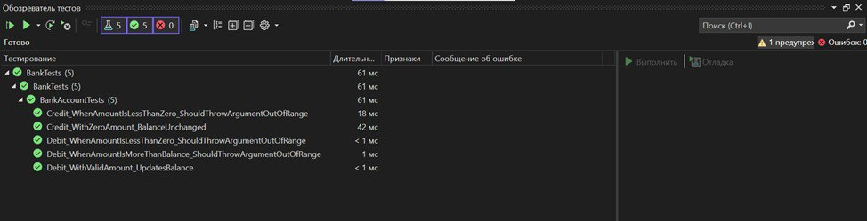

### Программа работает

### Запускаем  и видим что один тест не проходит проверку
.jpg)
### Чтобы исправить эту ошибку, в файле BankAccount.cs заменяем строку:
m_balance += amount; на: m_balance -= amount;

### Cоздали второй модульный тест
Для проведения автоматизированного тестирования метода Credit, который вызывается, когда денежные средства поступают на счет. Предусмотрите наличие в нем необходимых тестовых методов.

### Все тесты прогли проверку, тк код написан правильно
